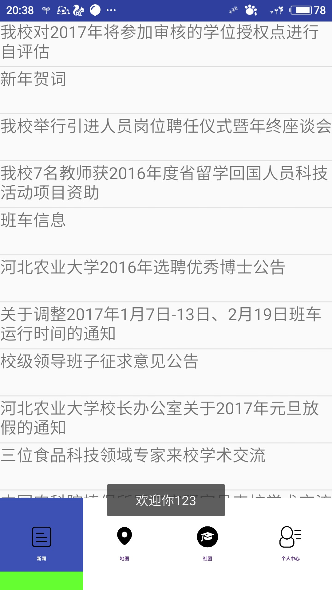
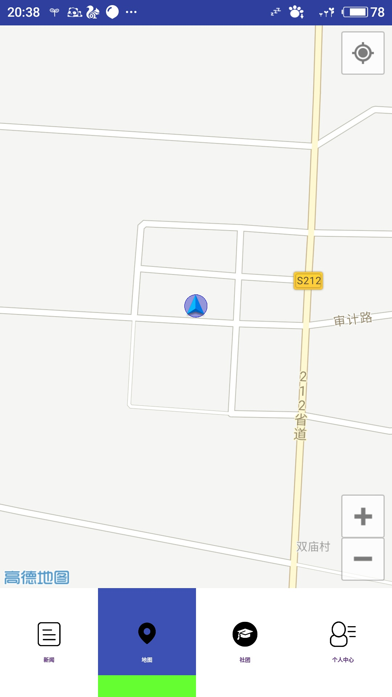
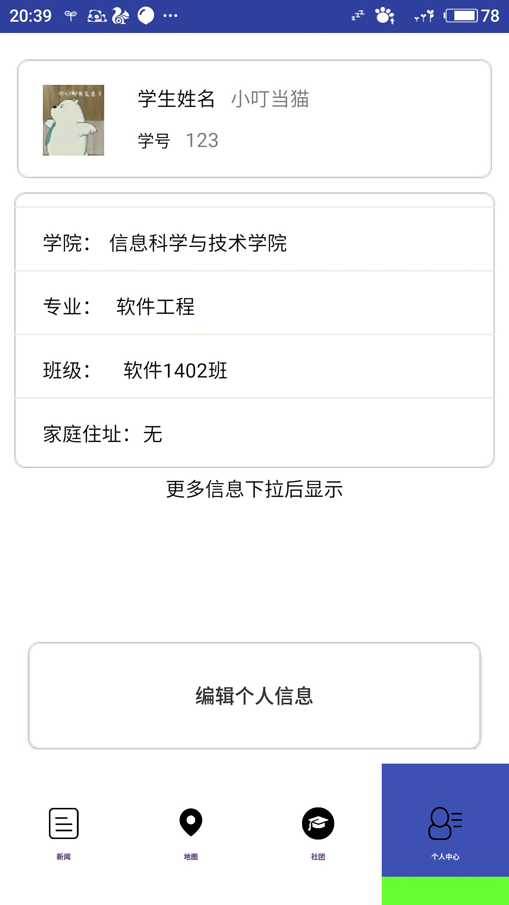
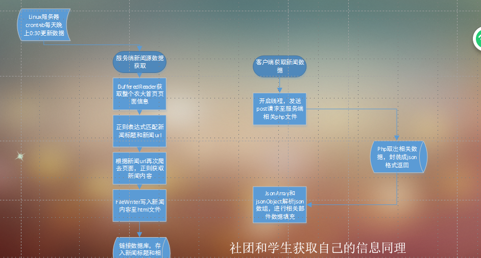

###感想##
参加java比赛真的收获很大，与人比较沟通，才会知道自己的不足。赵杰，王赛，佳琪、杨硕他们的团队配合，技术能力都是很强的。自己还是太弱。那天下午，心里很不舒服，但是却收获很多。加油！ 于寒假写1/16/2017 8:26:32 PM
##软件实现
实现了

（1）新闻展示：linux服务端定时抓取新闻存入数据库，客户端发送请求获取新闻数据并显示。

（2）用户位置显示

（3）社团信息展示，用户支持社团且只能支持一次。

（4）显示用户信息

##软件截图##

##功能分析

##e-r图

##老师提出的问题## 
自己的新闻是每天晚上全部更新，但是可能隔天新闻并不会更新，或者更新只更新一个，你现在新闻少，那么没什么问题，如果新闻多了，就会出现效率问题。
## 一：技术点 ##
### 1.Android：imeOptions属性 ###
默认情况下软键盘右下角的按钮为“下一个”，点击会到下一个输入框，保持软键盘。

设置 android:imeOptions="actionDone" ，软键盘下方变成“完成”，点击后光标保持在原来的输入框上，并且软键盘关闭

Android input属性的介绍https://developer.android.com/training/keyboard-input/style.html#Type
### 2 Android底部导航栏实现 ###
参考博文http://www.jianshu.com/p/ce1d060573ba 

禁止viewpage手动滑动重写方法
http://blog.csdn.net/allen315410/article/details/40744287
### 3.Android php mysql 新闻列表###
极客学院课程：http://www.jikexueyuan.com/course/559.html

获取新闻的部分本来想用php来做来着，想到这事java竞赛就用Java了。尽量用Java吧(⊙v⊙)
### 4 linux命令行配置java环境####
http://blog.csdn.net/u010912383/article/details/51955636
### 5 linux命令行引入jar包 ###
编译` javac -cp /home/cys/lib/javacsv.jar /home/cys/lib/CsvTest.java `

运行` java -cp /home/cys/lib/javacsv.jar:/home/cys/lib/CsvTest CsvTest `

需要注意的几点是： 
   1、编译的时候，需要使用-cp环境变量来引入外部jar的地址。-cp也可以换成-classpath。 
   2、运行过程中，环境变量-cp中一定要加入编译时候生成的class文件的路径。并且用冒号分割。记住，在windows下环境变量是使用引号分割的。但是在Linux下环境变量需要使用冒号分割。 
### 6 linx定时器任务 ###
http://linuxtools-rst.readthedocs.io/zh_CN/latest/tool/crontab.html
### 7编码问题 ###
很奇怪，文件本身是utf8的，我再Android webview里设置utf8竟然乱码，设置gbk竟然显示正常，奇怪。
(并不奇怪，请务必确保，你的任何工程的东西编码都是一致的，包括项目的编码1！！！)