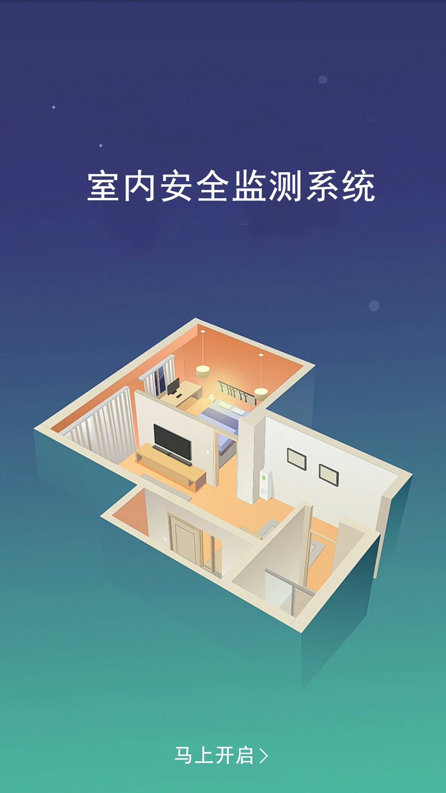
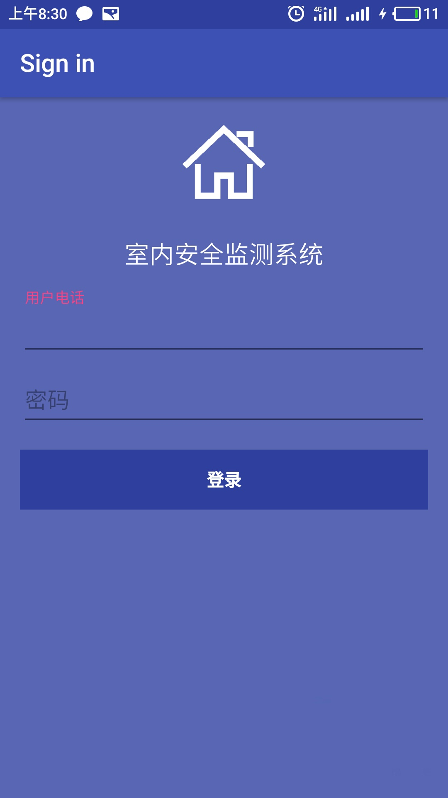
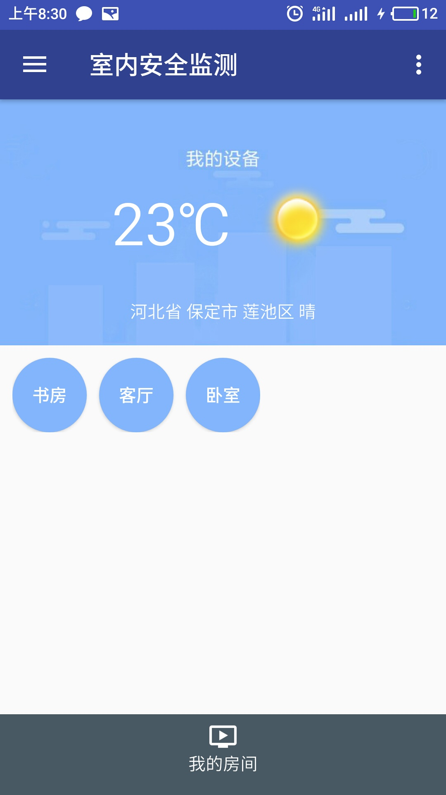
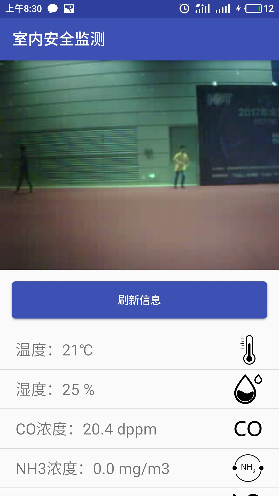
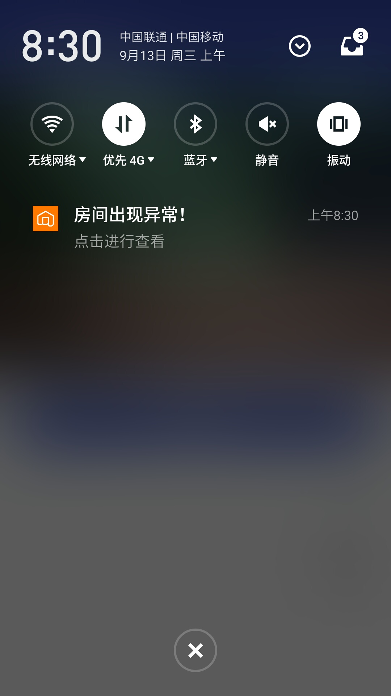
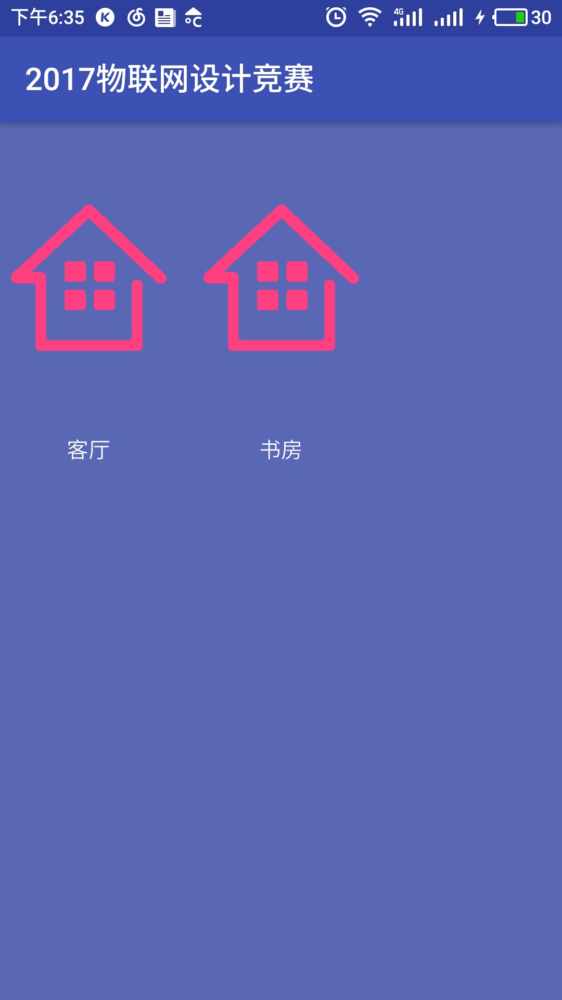
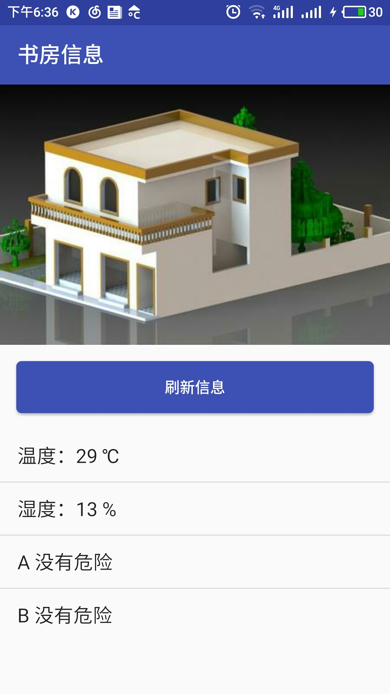

##第二版
过了省赛后，做了部分改进，UI方面做了一些调整。运用高德地图和心知天气来显示天气。后台写了一个一直在跑的服务，如果气体信息出现异常，震动和通知栏提醒用户出现异常。
最主要的是后台服务和前台通知栏那块，参考了《Android第一行代码》书籍和网上的相关知识，做了出来。

###1.底部导航github

https://github.com/RoyWallace/BottomNavigationBar

###2.Android前台服务service解析

http://blog.csdn.net/lfdfhl/article/details/9998987

###3.全面了解Android notification

http://www.jianshu.com/p/22e27a639787

演示图片

##第一版

###1 assets目录使用
主要用来放天气信息的那几十张照片

http://blog.csdn.net/fengyuzhengfan/article/details/38360017
###2 listview与adapter用法

http://www.cnblogs.com/zhengbeibei/archive/2013/05/14/3078805.html

##正文
做这个是为了和宇航参加2017物联网设计竞赛，和之前和宇航合作的智能拐杖逻辑大体是类似的。效果图如下

##要点一：16进制转图片并显示问题
从宇航那里拿到的是一大堆16进制数据，我需要将其转换为图片并进行显示，从网上找了很多资料，最后成功做了出来。关键代码如下

	public void setImage(String imageStr){

                mRestart = BytesUtil.hexStringToBytes(imageStr);

        Bitmap bmp = BitmapFactory.decodeByteArray(mRestart, 0, mRestart.length);

        ImageView image = (ImageView) findViewById(R.id.image);

        image.setImageBitmap(bmp);
    }
##要点二：关于图片数据不完整问题

测试的时候因为图片数据转换成16进制实在太大，导致接受数据是分段接受。后来尝试c语言的socket问题依旧存在，所以最后用逻辑把图片数据合并在一起了。因为图片开始是ffd8，结尾是ffd9利用这个性质合并图片数据。关键代码如下：

	//开始吧
				$flag=substr($data, 0,4);
				if($flag == "ffd8" || $f == -1){
					if(strpos($data,"ffd9") == null){
						$res.=$data;
						$f=-1;
					}
					else{
						$temp=substr($data, 0,strpos($data, "ffd9")+4);
						$res.=$temp;
						echo "get".$res."\n";
						$sql="update test set image='".$res."' where id=2";
						$res=mysql_query($sql);
						//print_r(mysql_fetch_array($res));
						if($res){
							echo "ok";
						}
						else{
							echo "wrong";
						}
						echo "\n";
						$res="";
						$f=0;
					}
				}

##要点三：按钮美化圆形与点击效果

让我心情最舒畅的是美工又提升了点儿，利用到了学校实训时《Android编程权威指南》书上的按钮美化部分，主要是按钮圆角矩形与点击变色。