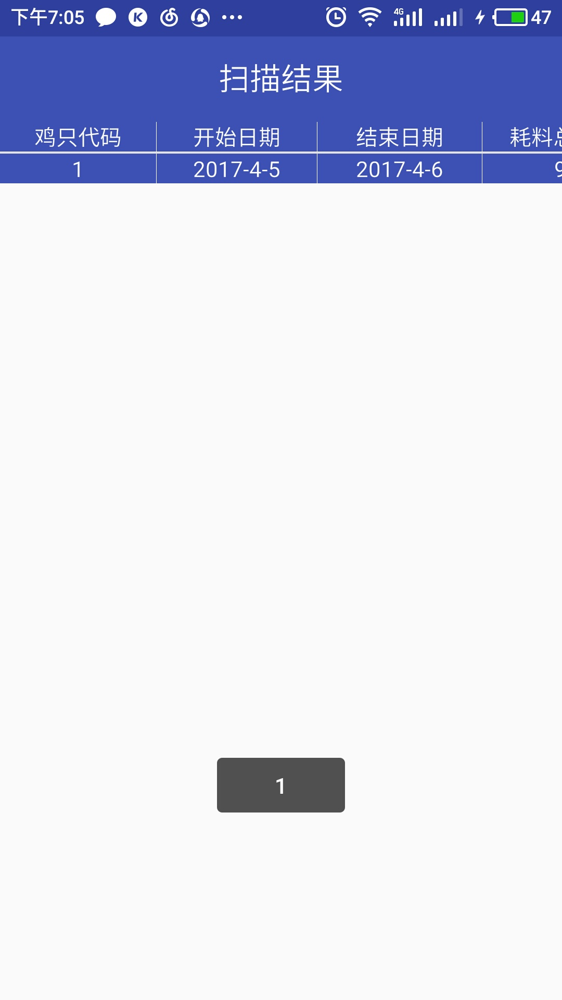
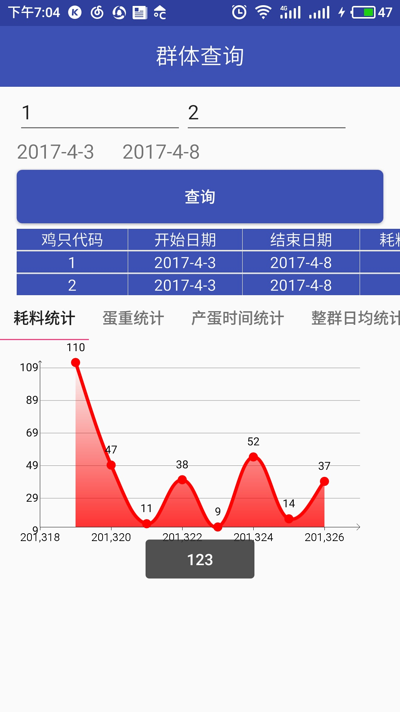
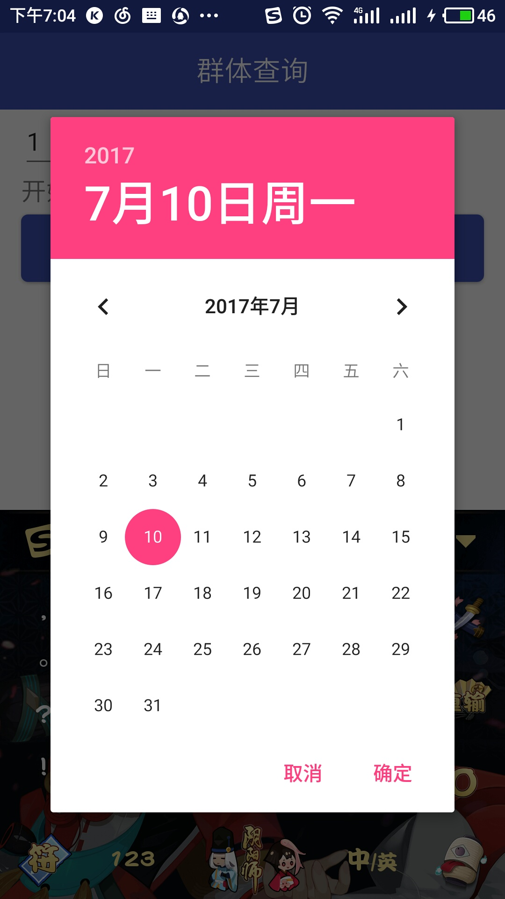
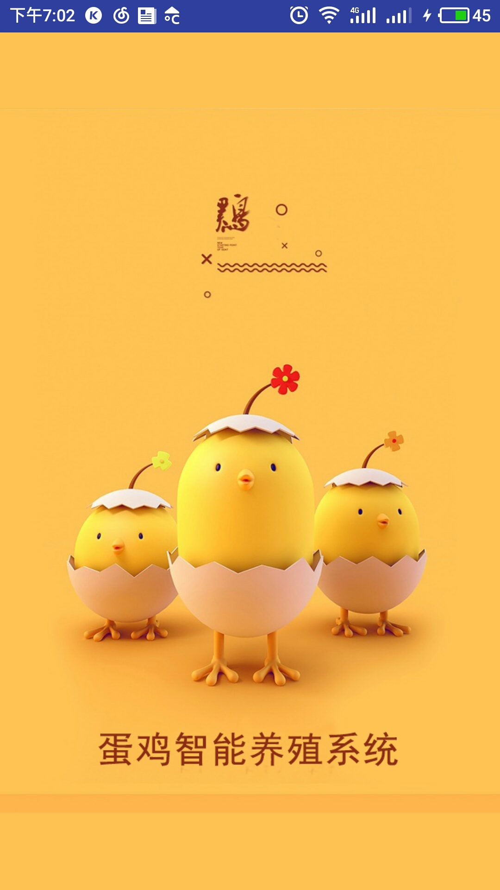

##1、listview表格

http://blog.csdn.net/hellogv/article/details/6075014

## 2.输入法将背景图片顶上去
相信做过android开发的都知道，当界面中有editText的时候，输入法可能导致把当前界面整个给顶上去，这时候我们只需要在AndroidManifest.xml中给这个Activity添加 android:windowSoftInputMode="adjustPan" 即可解决这问题。

##分割线

说来有些惭愧，这个东西做完很长时间了，当时花了自己很长时间，自己一直没有去整理。
##目的

当时和玉洁一起参加互联网+和挑战杯时做的一个软件。效果图如下

##要点

主要难点是那个报表的处理，自己在这上面花的时间最长，自己尝试了很多报表开源项目，有超级复杂的也有很多简单的，最后选择了https://github.com/Idtk/SmallChart这个开源项目，主要是因为其简单移植方便，而且我尝试去联系作者，作者也很热情的给我技术上的回复。

扫描二维码用的是zxing开源项目，其实自己直接把代码弄过来了，从项目名称也不难看出。

